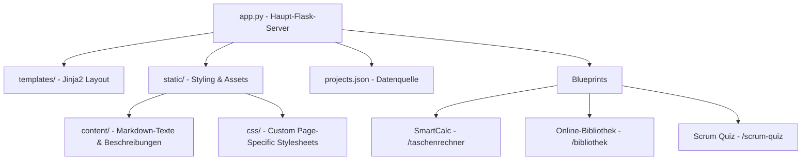

# José Luis Juárez - Portfolio Ökosystem

[](https://www.python.org/)
[](https://flask.palletsprojects.com/)
[](https://sqlite.org/)
[](https://ollama.com/)
[](https://getbootstrap.com/)

Willkommen auf dem Repository meines persönlichen Portfolio-Ökosystems! Diese Webanwendung dient als digitale Visitenkarte und interaktiver Showcase meiner Fähigkeiten als angehender **Anwendungsentwickler**.

Die App ist nicht nur eine statische Website, sondern ein **modulares Hub**, das mehrere eigenständige Webanwendungen über **Flask-Blueprints** unter einer einzigen Domain vereint.

---

## Über mich: Vom Koch zum Coder

Als ehemaliger Koch weiß ich, wie wichtig das perfekte Zusammenspiel aller Zutaten ist. In der Softwareentwicklung sehe ich Frontend und Backend als zwei Seiten desselben Gerichts. Die **Fullstack-Entwicklung** ist mein Fokus: Ich liebe es, die volle Kontrolle über das Endprodukt zu behalten, schätze aber auch die Arbeitsteilung und den strukturierten Austausch im Team – genau wie in einer gut eingespielten Küchenbrigade.

---

## Systemarchitektur & Modularer Aufbau

Das Projekt nutzt eine **Blueprint-Architektur**, um verschiedene Sub-Projekte sauber voneinander zu trennen und sie dennoch nahtlos in das Haupt-Portfolio zu integrieren.



---

## Die integrierten Projekte im Detail

### 1. Online-Bibliothek mit Ollama-RAG-KI (`/bibliothek`)

Eine moderne Bibliotheksplattform, die klassisches Web-CRUD mit modernster Künstlicher Intelligenz (Retrieval-Augmented Generation) verbindet.

- **Rollenbasierter Zugriff (RBAC):** Eigene Dashboards für Mitarbeiter (CRUD-Kundenverwaltung inkl. Aktivitätsstatus `ist_aktiv`, Buch- & E-Book-Katalog, globale Verleih- und Rückgabeübersicht) und Kunden (physische Buchausleihe nach Bestand, digitale E-Book-Lizenzen, In-Browser PDF-Reader).
- **RAG-KI-Bibliothekar:** Ein interaktiver Chatbot (ausgeführt mit `gemma4:31b` via Ollama-API), der auf Basis des echten Buchbestandes und kompakter Zusammenfassungen personalisierte Empfehlungen ausspricht.
- **Token-Ökonomie & Antwort-Cache:** Optimiertes Antwortbudget (`max_tokens: 500`) für strukturierte 3-Absatz-Antworten, bis zu 80 % Token-Ersparnis durch Kontext-Kompression sowie SQLite-Antwort-Cache (`ki_cache`) für latenzfreie Antworten (0,01s, 0 Tokens) bei wiederholten Fragen.
- **Graceful Degradation (Ausfallschutz):** Automatischer Heuristik-Fallback auf eine integrierte Katalogsuche bei Ausfall oder Rate-Limits des KI-Dienstes.
- **Intelligentes E-Book-Parsing & Sammel-Import:** Beim PDF-Upload liest das System automatisch den Text aus und generiert über die KI strukturierte Metadaten (Titel, Autor, ISBN, Zusammenfassung). Erkennt bei Sammel-Dokumenten mehrere Bücher oder Nutzer und legt alle Einträge automatisch in einem einzigen Durchlauf an.
- **Sicherheit & Verifikations-Workflow:** Zwei-Schritt-Registrierung mit 6-stelligem Verifizierungstoken, konsequente Prepared Statements (SQL-Injection-Schutz), XSS-Maskierung, BCRYPT-Passworthashing, Session-/Cache-Control (`no-store, no-cache`) und SQLite3-Kaskadierung (`ON DELETE CASCADE`).
- **Test-Zugangsdaten:**
  - **Admin / Bibliothekar:** `admin@bib.de` (Passwort: `admin123`)
  - **Kunde / Standard-Nutzer:** `jan@va.de` (Passwort: `user123`)

### 2. SmartCalc – Wissenschaftlicher Web-Taschenrechner (`/taschenrechner`)

Eine Portierung einer Desktop-Anwendung in eine performante Web-App.

- **Sicherer Rechen-Parser:** Serverseitige Python-Logik mit Whitelist-Validierung und RegEx-Preprocessing zur Verhinderung von Code-Injection.
- **Erweiterte Mathematik:** Volle Unterstützung für Trigonometrie, Logarithmen, Wurzeln und Potenzen.
- **Modernes Web-UI:** Flüssiges Glassmorphic-Responsive-UI mit Dark- & Light-Mode-Unterstützung.
- **Verlauf-Verwaltung:** Über eine REST-API gesteuerte Historie der Berechnungen.

### 3. Scrum Quiz App (`/scrum-quiz`)

Eine interaktive Anwendung zur zielgerichteten Vorbereitung auf die **PSM I (Professional Scrum Master I)** Zertifizierung.

- **Konfigurierbar & Dynamisch:** Auswahl von 1 bis 120 Fragen, wobei sich das Zeitlimit dynamisch anpasst.
- **Mehrsprachigkeit:** Unterstützung für Deutsch und Englisch via strukturierter JSON-Fragenkataloge (`questions_de.json` / `questions_en.json`).
- **Client-seitige Engine:** Schnelle, JavaScript-basierte Auswertung mit direktem Korrektur-Feedback.

### 4. Milo Radio App (PWA)

Eine Progressive Web App der nächsten Generation (extern verlinkt, aber Teil des Showcases).

- **Fullstack-Architektur:** JavaScript-Frontend kommuniziert mit einem PHP/PostgreSQL-Backend.
- **Trends & Analyse:** Anonymisiertes Tracking von Hörgewohnheiten zur Erstellung von Top-Listen in Echtzeit.
- **Offline-First:** Service-Worker-Caching sorgt dafür, dass die App auch bei instabiler Internetverbindung läuft.

---

## Hauptfeatures des Portfolios

- **Redesigned UI/UX:** Moderner, minimalistischer Premium-Look mit **Glassmorphic-Effekten**, harmonischen Farbpaletten und CSS-Micro-Animations.
- **Content-Logik-Trennung:** Dynamische Texte (wie der "Über mich"-Text oder Projektinfos) werden über Markdown-Dateien (`markdown2`) und eine zentrale `projects.json` verwaltet.
- **Sicheres Kontaktformular:** Integrierter E-Mail-Versand (`Flask-Mail`) geschützt durch:
  - **CSRF-Schutz** (`Flask-WTF`)
  - **Honeypot-Feld** (unsichtbar für Nutzer, fängt automatisierte Spam-Bots ab)
  - **Zeitbasierte Prüfung** (verhindert das Absenden innerhalb von < 3 Sekunden nach dem Laden)
  - **Math-Captcha** (Rechenaufgabe als menschliche Verifizierung)

---

## Verzeichnisstruktur

```text
.
├── calculator/            # Blueprint für den Taschenrechner
├── online_bibliothek/     # Blueprint für die Online-Bibliothek (mit SQLite & Ollama)
├── scrum_quiz/            # Blueprint für das Scrum Quiz (Fragenkataloge)
├── static/
│   ├── content/           # Markdown- & Textdateien für dynamische Inhalte (about_me.md, etc.)
│   ├── css/               # Seitenspezifische CSS-Stylesheets
│   ├── images/            # Bild-Assets für Projekte
│   └── js/                # Custom JavaScript für Frontend-Interaktionen
├── templates/             # Jinja2 HTML-Templates (base.html, home.html, about.html, etc.)
├── app.cgi                # CGI-Wrapper für Shared-Hosting (Strato)
├── app.py                 # Zentraler Flask-Einstiegspunkt
├── config.ini.example     # Vorlage für Umgebungsvariablen und E-Mail-Einstellungen
├── projects.json          # Zentrale JSON-Datenquelle für die Portfolio-Projekte
├── requirements.txt       # Python-Abhängigkeiten
├── CHANGELOG.md           # Änderungshistorie und Release-Dokumentation
└── README.md              # Diese Dokumentation
```

---

## Lokale Installation & Ausführung

Folge diesen Schritten, um das Portfolio-Ökosystem lokal auszuführen:

### 1. Repository klonen

```bash
git clone https://github.com/JLJ-HH/portfolio_flask.git
cd portfolio_flask
```

### 2. Virtuelle Umgebung erstellen und aktivieren

```bash
# Windows
python -m venv venv
venv\Scripts\activate

# macOS / Linux
python3 -m venv venv
source venv/bin/activate
```

### 3. Abhängigkeiten installieren

```bash
pip install -r requirements.txt
```

### 4. Konfiguration anlegen

Kopiere die Beispiel-Konfiguration und passe deine Daten an (insbesondere die E-Mail-Zugangsdaten für das Kontaktformular):

```bash
cp config.ini.example config.ini
```

### 5. Anwendung starten

```bash
python app.py
```

Die Anwendung ist nun unter `http://127.0.0.1:5000` erreichbar.

> [!NOTE]
> **Hinweis für die Online-Bibliothek mit KI-Funktion:** Stelle sicher, dass [Ollama](https://ollama.com/) lokal läuft und das Modell `gemma4:31b` (oder ein in der Konfiguration/Route definiertes Modell) geladen ist.
>
> **Test-Zugangsdaten für den Login:**
> - **Admin / Bibliothekar:** `admin@bib.de` / `admin123`
> - **Kunde / Standard-Nutzer:** `jan@va.de` / `user123`

---

## CGI-Deployment (z.B. bei Strato)

Das Portfolio ist speziell für die Ausführung in Shared-Hosting-Umgebungen via CGI optimiert:

- **`.htaccess`**: Leitet alle Anfragen (außer statische Assets) mittels Mod-Rewrite an die `app.cgi` weiter.
- **`app.cgi`**:
  - Nutzt den `ScriptNameFixer` der WSGI-Bibliothek, um saubere URLs (ohne das lästige `/app.cgi/` in der Adresszeile) zu erzielen.
  - Beinhaltet einen **integrierten Auto-Installer**, der beim ersten Start im venv automatisch fehlende Bibliotheken aus der `requirements.txt` nachinstalliert und Systembibliotheken (wie `bcrypt`) kompiliert und repariert.

---

## Autor & Links

- **Name:** José Luis Juárez
- **Beruf:** Angehender Anwendungsentwickler
- **Standort:** Hamburg, Deutschland
- **GitHub:** [@JLJ-HH](https://github.com/JLJ-HH)
- **LinkedIn:** [José Luis Juárez](https://www.linkedin.com/in/jose-luis-juarez/)
- **Live-Portfolio:** [jljuarez.de](https://jljuarez.de/)
