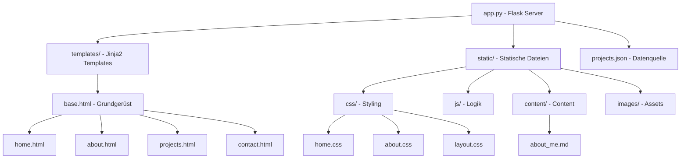

# Projekt-Struktur & Architektur

Dieser Plan gibt eine Übersicht über den Aufbau des Flask-Portfolios und die Verantwortlichkeiten der einzelnen Komponenten.

## Architektur-Übersicht

## Dateiverzeichnis

- **`app.py`**: Der zentrale Einstiegspunkt. Hier werden die Routes definiert, die `projects.json` geladen und das Mail-Setup verwaltet.
- **`projects.json`**: Enthält alle Projektdaten (Titel, Tech-Stack, Links, Beschreibungen).
- **`templates/`**:
    - `base.html`: Beinhaltet Navbar und Footer, die auf jeder Seite gleich sind.
    - `about.html`: Nutzt ein 70/30 Split-Layout für maximale visuelle Wirkung.
- **`static/`**:
    - `content/about_me.md`: Erlaubt es, den "Über mich" Text einfach in Markdown/HTML zu pflegen, ohne den Code zu ändern.
    - `css/home.css` & `about.css`: Enthalten das spezifische Premium-Styling für die jeweiligen Seiten.

## Datenfluss

1. Der Nutzer ruft eine URL auf (z.B. `/projects`).
2. Flask-Route in `app.py` verarbeitet die Anfrage.
3. Daten werden aus `projects.json` oder `.md` Dateien geladen.
4. Jinja2 rendert das passende Template und injiziert die Daten.
5. Die fertige HTML-Seite wird an den Browser geliefert.
